<h1>Table of Contents<span class="tocSkip"></span></h1>
<div class="toc"><ul class="toc-item"><li><span><a href="#Julia-可视化库：VegaLite.jl-【笔记1---安装】" data-toc-modified-id="Julia-可视化库：VegaLite.jl-【笔记1---安装】-1"><span class="toc-item-num">1&nbsp;&nbsp;</span>Julia 可视化库：VegaLite.jl 【笔记1 - 安装】</a></span><ul class="toc-item"><li><span><a href="#什么是-Vega-和-VegaLite" data-toc-modified-id="什么是-Vega-和-VegaLite-1.1"><span class="toc-item-num">1.1&nbsp;&nbsp;</span>什么是 Vega 和 VegaLite</a></span></li><li><span><a href="#安装-VegaLite.jl" data-toc-modified-id="安装-VegaLite.jl-1.2"><span class="toc-item-num">1.2&nbsp;&nbsp;</span>安装 VegaLite.jl</a></span></li><li><span><a href="#说明" data-toc-modified-id="说明-1.3"><span class="toc-item-num">1.3&nbsp;&nbsp;</span>说明</a></span></li></ul></li><li><span><a href="#Julia-可视化库：VegaLite.jl-【笔记2---@vlplot-宏】" data-toc-modified-id="Julia-可视化库：VegaLite.jl-【笔记2---@vlplot-宏】-2"><span class="toc-item-num">2&nbsp;&nbsp;</span>Julia 可视化库：VegaLite.jl 【笔记2 - @vlplot 宏】</a></span><ul class="toc-item"><li><span><a href="#@vlplot" data-toc-modified-id="@vlplot-2.1"><span class="toc-item-num">2.1&nbsp;&nbsp;</span>@vlplot</a></span><ul class="toc-item"><li><span><a href="#速写字符串语法（Shorthand-string-syntax）" data-toc-modified-id="速写字符串语法（Shorthand-string-syntax）-2.1.1"><span class="toc-item-num">2.1.1&nbsp;&nbsp;</span>速写字符串语法（Shorthand string syntax）</a></span><ul class="toc-item"><li><span><a href="#字符型数据" data-toc-modified-id="字符型数据-2.1.1.1"><span class="toc-item-num">2.1.1.1&nbsp;&nbsp;</span>字符型数据</a></span></li><li><span><a href="#数值型数据" data-toc-modified-id="数值型数据-2.1.1.2"><span class="toc-item-num">2.1.1.2&nbsp;&nbsp;</span>数值型数据</a></span></li></ul></li><li><span><a href="#分面-(facet)" data-toc-modified-id="分面-(facet)-2.1.2"><span class="toc-item-num">2.1.2&nbsp;&nbsp;</span>分面 (facet)</a></span></li></ul></li></ul></li><li><span><a href="#Julia-可视化库：VegaLite.jl-【笔记3---vl-宏】" data-toc-modified-id="Julia-可视化库：VegaLite.jl-【笔记3---vl-宏】-3"><span class="toc-item-num">3&nbsp;&nbsp;</span>Julia 可视化库：VegaLite.jl 【笔记3 - vl 宏】</a></span><ul class="toc-item"><li><span><a href="#vl-字符串宏" data-toc-modified-id="vl-字符串宏-3.1"><span class="toc-item-num">3.1&nbsp;&nbsp;</span>vl 字符串宏</a></span><ul class="toc-item"><li><span><a href="#例子" data-toc-modified-id="例子-3.1.1"><span class="toc-item-num">3.1.1&nbsp;&nbsp;</span>例子</a></span></li></ul></li><li><span><a href="#@vlplot-VS-Vega-Lite-JSON-格式" data-toc-modified-id="@vlplot-VS-Vega-Lite-JSON-格式-3.2"><span class="toc-item-num">3.2&nbsp;&nbsp;</span>@vlplot <em>VS</em> Vega-Lite JSON 格式</a></span><ul class="toc-item"><li><span><a href="#例子" data-toc-modified-id="例子-3.2.1"><span class="toc-item-num">3.2.1&nbsp;&nbsp;</span>例子</a></span></li><li><span><a href="#说明" data-toc-modified-id="说明-3.2.2"><span class="toc-item-num">3.2.2&nbsp;&nbsp;</span>说明</a></span></li><li><span><a href="#IO:-VegaLite-Json-格式文件" data-toc-modified-id="IO:-VegaLite-Json-格式文件-3.2.3"><span class="toc-item-num">3.2.3&nbsp;&nbsp;</span>IO: VegaLite Json 格式文件</a></span></li></ul></li></ul></li><li><span><a href="#Julia-可视化库：VegaLite.jl-【笔记4---数据来源】" data-toc-modified-id="Julia-可视化库：VegaLite.jl-【笔记4---数据来源】-4"><span class="toc-item-num">4&nbsp;&nbsp;</span>Julia 可视化库：VegaLite.jl 【笔记4 - 数据来源】</a></span><ul class="toc-item"><li><span><a href="#内部数据来源" data-toc-modified-id="内部数据来源-4.1"><span class="toc-item-num">4.1&nbsp;&nbsp;</span>内部数据来源</a></span><ul class="toc-item"><li><span><a href="#Julia-表格数据结构" data-toc-modified-id="Julia-表格数据结构-4.1.1"><span class="toc-item-num">4.1.1&nbsp;&nbsp;</span>Julia 表格数据结构</a></span></li><li><span><a href="#管道操作数据" data-toc-modified-id="管道操作数据-4.1.2"><span class="toc-item-num">4.1.2&nbsp;&nbsp;</span>管道操作数据</a></span></li></ul></li><li><span><a href="#外部数据来源" data-toc-modified-id="外部数据来源-4.2"><span class="toc-item-num">4.2&nbsp;&nbsp;</span>外部数据来源</a></span></li></ul></li><li><span><a href="#Julia-可视化库：VegaLite.jl-【笔记5---绘图类型-mark】" data-toc-modified-id="Julia-可视化库：VegaLite.jl-【笔记5---绘图类型-mark】-5"><span class="toc-item-num">5&nbsp;&nbsp;</span>Julia 可视化库：VegaLite.jl 【笔记5 - 绘图类型 mark】</a></span><ul class="toc-item"><li><span><a href="#Galary-&amp;-API" data-toc-modified-id="Galary-&amp;-API-5.1"><span class="toc-item-num">5.1&nbsp;&nbsp;</span>Galary &amp; API</a></span></li><li><span><a href="#mark-特性" data-toc-modified-id="mark-特性-5.2"><span class="toc-item-num">5.2&nbsp;&nbsp;</span><code>mark</code> 特性</a></span></li><li><span><a href="#几个栗子" data-toc-modified-id="几个栗子-5.3"><span class="toc-item-num">5.3&nbsp;&nbsp;</span>几个栗子</a></span><ul class="toc-item"><li><span><a href="#Example1" data-toc-modified-id="Example1-5.3.1"><span class="toc-item-num">5.3.1&nbsp;&nbsp;</span>Example1</a></span></li><li><span><a href="#Example2" data-toc-modified-id="Example2-5.3.2"><span class="toc-item-num">5.3.2&nbsp;&nbsp;</span>Example2</a></span></li><li><span><a href="#Example3" data-toc-modified-id="Example3-5.3.3"><span class="toc-item-num">5.3.3&nbsp;&nbsp;</span>Example3</a></span></li><li><span><a href="#Example4" data-toc-modified-id="Example4-5.3.4"><span class="toc-item-num">5.3.4&nbsp;&nbsp;</span>Example4</a></span></li><li><span><a href="#Example5" data-toc-modified-id="Example5-5.3.5"><span class="toc-item-num">5.3.5&nbsp;&nbsp;</span>Example5</a></span></li></ul></li></ul></li><li><span><a href="#Julia-可视化库：VegaLite.jl-【笔记6---transform-之-aggregate】" data-toc-modified-id="Julia-可视化库：VegaLite.jl-【笔记6---transform-之-aggregate】-6"><span class="toc-item-num">6&nbsp;&nbsp;</span>Julia 可视化库：VegaLite.jl 【笔记6 - transform 之 aggregate】</a></span><ul class="toc-item"><li><span><a href="#aggregate-特性" data-toc-modified-id="aggregate-特性-6.1"><span class="toc-item-num">6.1&nbsp;&nbsp;</span><code>aggregate</code> 特性</a></span></li><li><span><a href="#栗子" data-toc-modified-id="栗子-6.2"><span class="toc-item-num">6.2&nbsp;&nbsp;</span>栗子</a></span></li><li><span><a href="#应用" data-toc-modified-id="应用-6.3"><span class="toc-item-num">6.3&nbsp;&nbsp;</span>应用</a></span></li></ul></li><li><span><a href="#Julia-可视化库：VegaLite.jl-【笔记7---transform-之-calculate】" data-toc-modified-id="Julia-可视化库：VegaLite.jl-【笔记7---transform-之-calculate】-7"><span class="toc-item-num">7&nbsp;&nbsp;</span>Julia 可视化库：VegaLite.jl 【笔记7 - transform 之 calculate】</a></span><ul class="toc-item"><li><span><a href="#calculate-特性" data-toc-modified-id="calculate-特性-7.1"><span class="toc-item-num">7.1&nbsp;&nbsp;</span><code>calculate</code> 特性</a></span></li><li><span><a href="#栗子" data-toc-modified-id="栗子-7.2"><span class="toc-item-num">7.2&nbsp;&nbsp;</span>栗子</a></span></li><li><span><a href="#应用" data-toc-modified-id="应用-7.3"><span class="toc-item-num">7.3&nbsp;&nbsp;</span>应用</a></span></li></ul></li><li><span><a href="#Julia-可视化库：VegaLite.jl-【笔记8---transform-之-filter】" data-toc-modified-id="Julia-可视化库：VegaLite.jl-【笔记8---transform-之-filter】-8"><span class="toc-item-num">8&nbsp;&nbsp;</span>Julia 可视化库：VegaLite.jl 【笔记8 - transform 之 filter】</a></span><ul class="toc-item"><li><span><a href="#filter-特性" data-toc-modified-id="filter-特性-8.1"><span class="toc-item-num">8.1&nbsp;&nbsp;</span><code>filter</code> 特性</a></span></li><li><span><a href="#栗子" data-toc-modified-id="栗子-8.2"><span class="toc-item-num">8.2&nbsp;&nbsp;</span>栗子</a></span></li><li><span><a href="#应用" data-toc-modified-id="应用-8.3"><span class="toc-item-num">8.3&nbsp;&nbsp;</span>应用</a></span></li></ul></li></ul></div>

# Julia 可视化库：VegaLite.jl 【笔记1 - 安装】

## 什么是 Vega 和 VegaLite

`Vega` 是一种可视化语法，一种用于创建，保存和共享交互式可视化设计的声明性语言。`Vega` 采用 `JSON` 格式描述可视化的视觉外观和交互行为，并使用 HTML5 Canvas 或 SVG 生成基于 Web 的视图。

`Vega-Lite` 是一种高级可视化语法。它支持简洁的 `JSON` 语法，用于支持快速生成可视化以支持分析。`Vega-Lite` 支持交互式多视图图形，可以编译成 `Vega`。

`Vega` 有着广泛的第三方应用，参见 <https://vega.github.io/vega-lite/applications.html>

| Julia                                                      | Python                                                       | R                                              | Elm                                                          | Markdown                       | 工具                                                         |
| ---------------------------------------------------------- | ------------------------------------------------------------ | ---------------------------------------------- | ------------------------------------------------------------ | ------------------------------ | ------------------------------------------------------------ |
| **[VegaLite.jl](https://github.com/fredo-dedup/VegaLite.jl)** | **[PdVega](https://jakevdp.github.io/pdvega/)**、**[Altair](https://altair-viz.github.io/)** | [altair](https://vegawidget.github.io/altair/) | [Elm-Vega](http://package.elm-lang.org/packages/gicentre/elm-vega/latest) | [visdown](http://visdown.com/) | [Vega-Editor](https://vega.github.io/editor/)、[vega-desktop](https://github.com/kristw/vega-desktop)、 **[Voyager](https://github.com/vega/voyager)**、 [vega-embed](https://github.com/vega/vega-embed) |

**VegaLite.jl** 文档绘图例子： http://fredo-dedup.github.io/VegaLite.jl/stable/index.html

**VegaLite** 官方 Example Galary： https://vega.github.io/vega-lite/examples/

**VegaLite** API 文档( **JSON** 格式)： https://vega.github.io/vega-lite/docs/


## 安装 VegaLite.jl

安装命令（**Julia 0.6** 版本）：
```Julia
Pkg.add("VegaLite")
Pkg.add("IJulia")
Pkg.add("VegaDatasets")
```

参见： http://fredo-dedup.github.io/VegaLite.jl/stable/gettingstarted/installation.html

在 REPL 界面运行绘图命令默认使用浏览器窗口展示绘图，可安装 [ElectronDisplay.jl](https://github.com/davidanthoff/ElectronDisplay.jl) 以使用窗口展示绘图。

```Julia
Pkg.add("ElectronDisplay")
```

`VegaLite.jl` 在 Jupyter Notebook 中可展示绘图，可与 Jupyter Lab 或 nteract 进行交互式绘图。

支持 VS Code 和 Juno/Atom 插件。

## 说明

首先申明，本人 Julia 萌新一枚，非计算机专业，下面的笔记中使用的术语不够专业还请见谅 ~~

写这些笔记算是我开启 Julia 之旅的第一站吧。（顺便为 Julia 1.0 正式发布由衷地感到高兴 V.V）

其实 `VegaLite.jl` 这个库还在完善当中，并不是很成熟。而且学习到深入一点的时候，基本就是 `JSON` 写法 + 一些 `Julia` 语言特性了。

和 python 的 `Matplotlib` 库比起来， `Matplotlib` 能够精细地控制绘图的每一处细节，却在可视化表达上与数据的联系有所割裂，`Pandas` 封装了一部分绘图功能，把 dataframe 数据处理和 pyplot 连接起来，在可视化方面功能有限。而 `VegaLite.jl` 在数据可视化方面仿佛是**开箱即用，方便灵活**。

`Json` 格式在数据传输上独具优势，但是复杂的嵌套结构挺折磨人的... 试想在结构复杂一点的可视化代码里面穿插着写 **()** 、**[]** 、**{}** 不是一件愉快的事情啊。

可是无论怎样，**世界上没有绝对完美之事物**。 

`VegaLite.jl` 便利的可视化与 Julia 强大的性能结合或许能碰撞出我们意想不到的火花呢。

**→ 关于此笔记**

参考了以下两个链接：

1. http://fredo-dedup.github.io/VegaLite.jl/stable/gettingstarted/tutorial.html

2. https://vega.github.io/vega-lite/docs/

我使用的 Julia 版本为 0.6 (目前尚未在 0.7 和 1.0 版本上测试过)，编辑器为 `Jupyter Notebook`，所有代码在 [JuliaBox](https://www.juliabox.com/) 平台上运行通过。

运行环境如下 ↓

```
    JULIA_HOME: /opt/julia-0.6.2/bin
    Julia Version 0.6.2
    Commit d386e40c17 (2017-12-13 18:08 UTC)
    Platform Info:
      OS: Linux (x86_64-pc-linux-gnu)
      CPU: Intel(R) Xeon(R) CPU E5-2673 v3 @ 2.40GHz
      WORD_SIZE: 64
      BLAS: libopenblas (USE64BITINT DYNAMIC_ARCH NO_AFFINITY Haswell)
      LAPACK: libopenblas64_
      LIBM: libopenlibm
      LLVM: libLLVM-3.9.1 (ORCJIT, haswell)
```

# Julia 可视化库：VegaLite.jl 【笔记2 - @vlplot 宏】

这部分内容需要加载的库 ↓


```julia
using VegaLite, VegaDatasets
```

## @vlplot

`@vlplot` 宏命令是 VegaLite 中用于绘图的重要宏命令。

具体来看应用：以著名的 **cars** 数据集为例 ↓


```julia
cars = dataset("cars")
```


<table><thead><tr><th>Miles_per_Gallon</th><th>Cylinders</th><th>Origin</th><th>Weight_in_lbs</th><th>Displacement</th><th>Acceleration</th><th>Name</th><th>Year</th><th>Horsepower</th></tr></thead><tbody><tr><td>18.0</td><td>8</td><td>&quot;USA&quot;</td><td>3504</td><td>307.0</td><td>12.0</td><td>&quot;chevrolet chevelle malibu&quot;</td><td>&quot;1970-01-01&quot;</td><td>130</td></tr><tr><td>15.0</td><td>8</td><td>&quot;USA&quot;</td><td>3693</td><td>350.0</td><td>11.5</td><td>&quot;buick skylark 320&quot;</td><td>&quot;1970-01-01&quot;</td><td>165</td></tr><tr><td>18.0</td><td>8</td><td>&quot;USA&quot;</td><td>3436</td><td>318.0</td><td>11.0</td><td>&quot;plymouth satellite&quot;</td><td>&quot;1970-01-01&quot;</td><td>150</td></tr><tr><td>16.0</td><td>8</td><td>&quot;USA&quot;</td><td>3433</td><td>304.0</td><td>12.0</td><td>&quot;amc rebel sst&quot;</td><td>&quot;1970-01-01&quot;</td><td>150</td></tr><tr><td>17.0</td><td>8</td><td>&quot;USA&quot;</td><td>3449</td><td>302.0</td><td>10.5</td><td>&quot;ford torino&quot;</td><td>&quot;1970-01-01&quot;</td><td>140</td></tr><tr><td>15.0</td><td>8</td><td>&quot;USA&quot;</td><td>4341</td><td>429.0</td><td>10.0</td><td>&quot;ford galaxie 500&quot;</td><td>&quot;1970-01-01&quot;</td><td>198</td></tr><tr><td>14.0</td><td>8</td><td>&quot;USA&quot;</td><td>4354</td><td>454.0</td><td>9.0</td><td>&quot;chevrolet impala&quot;</td><td>&quot;1970-01-01&quot;</td><td>220</td></tr><tr><td>14.0</td><td>8</td><td>&quot;USA&quot;</td><td>4312</td><td>440.0</td><td>8.5</td><td>&quot;plymouth fury iii&quot;</td><td>&quot;1970-01-01&quot;</td><td>215</td></tr><tr><td>14.0</td><td>8</td><td>&quot;USA&quot;</td><td>4425</td><td>455.0</td><td>10.0</td><td>&quot;pontiac catalina&quot;</td><td>&quot;1970-01-01&quot;</td><td>225</td></tr><tr><td>15.0</td><td>8</td><td>&quot;USA&quot;</td><td>3850</td><td>390.0</td><td>8.5</td><td>&quot;amc ambassador dpl&quot;</td><td>&quot;1970-01-01&quot;</td><td>190</td></tr><tr><td>&vellip;</td><td>&vellip;</td><td>&vellip;</td><td>&vellip;</td><td>&vellip;</td><td>&vellip;</td><td>&vellip;</td><td>&vellip;</td><td>&vellip;</td></tr></tbody></table><p>... with 396 more rows.</p>


**可视化代码** ↓


```julia
cars |>
@vlplot(
    :point,
    x=:Horsepower,
    y=:Miles_per_Gallon
)
```


`|>` 为管道操作符，实现函数链式调用功能。

`:` 是一种**速写字符串语法（Shorthand string syntax）**：


- `:point` 实际上是指 `mark=:point`；


- `x=:Horsepower` 指定了 cars 数据中的 Horsepower 数据作为 x轴，等价于 `x="Horsepower"`；


- `y=:Miles_per_Gallon` 指定了 cars 数据中的 Miles_per_Gallon 数据作为 y轴，等价于 `y="Miles_per_Gallon"`。


### 速写字符串语法（Shorthand string syntax）

| type | abbr         | 意义            |
|------|--------------|-----------------|
| **:q**   | quantitative | 连续型          |
| **:n**   | nominal      | 离散型          |
| **:o**   | ordinal      | **有序**离散/连续型 |
| **:t**   | time serial  | 时间类型        |

#### 字符型数据

*字符串型数据 -> 默认为离散型变量*。

继续上面的例子，我们以离散型颜色区分不同国家的数据情况。


```julia
cars |>
@vlplot(
    :point,
    x=:Horsepower,
    y=:Miles_per_Gallon,
    color=:Origin,
    width=400,
    height=400
)
```


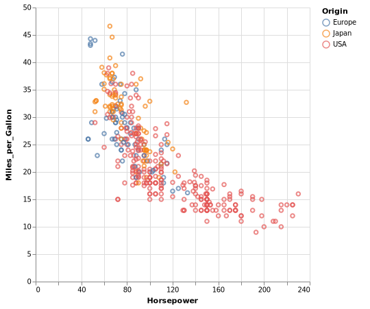


日期型字符串可转化成日期格式 ↓


```julia
cars |>
@vlplot(
    :point,
    x={"year(Year):t", axis={title="Year"}},
    y=:Miles_per_Gallon,
    color=:Origin,
    width=400,
    height=400
)
```


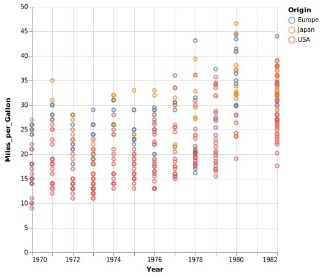


#### 数值型数据

*数值型数据 -> 默认为连续型变量*。

比如以颜色区分，可将数值转化成离散型变量（ `color="var:n"` ）或者使用渐变颜色（ `color="var:o"` ） ↓


```julia
cars |>
@vlplot(
    :point,
    x=:Horsepower,
    y=:Miles_per_Gallon,
    color=:Cylinders, # 默认为连续型变量
    width=400,
    height=400
)
```


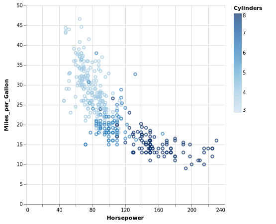


```julia
cars |>
@vlplot(
    :point,
    x=:Horsepower,
    y=:Miles_per_Gallon,
    color="Cylinders:n", # :n 表示 nominal,将数值型变量转化成离散型变量
    width=400,
    height=400
)
```


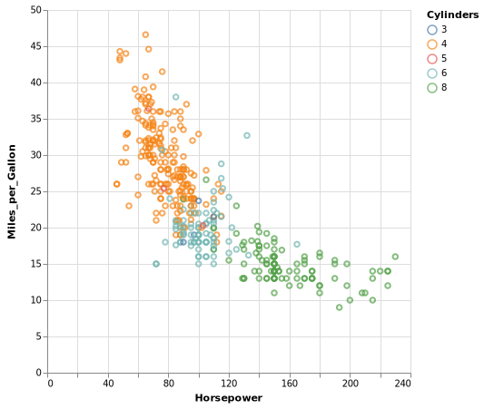


```julia
cars |>
@vlplot(
    :point,
    x=:Horsepower,
    y=:Miles_per_Gallon,
    color="Cylinders:o", # :o 表示 ordinal
    width=400,
    height=400
)
```


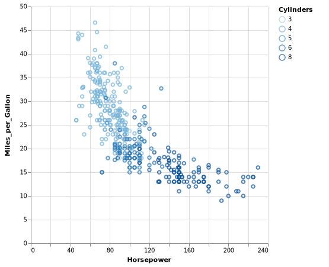


### 分面 (facet)

在 `VegaLite` 里使用分面相当简单，使用 `column` 或者 `row` 参数，指定相应数据即可 ↓


```julia
cars |>
@vlplot(
    :point,
    x=:Horsepower,
    y=:Miles_per_Gallon,
    color="Cylinders:n",
    column=:Origin,
    width=200,
    height=200
)
```


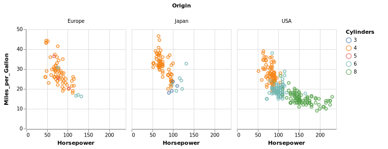


```julia
cars |>
@vlplot(
    :point,
    x=:Horsepower,
    y=:Miles_per_Gallon,
    color="Cylinders:o",
    column="year(Year):o",
    row=:Origin,
    width=200,
    height=200
)
```


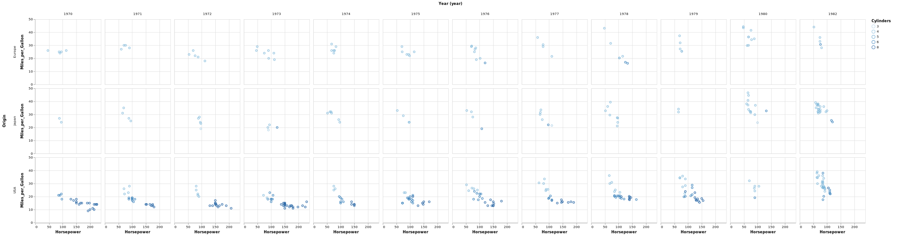


```julia
cars |>
@vlplot(
    :point,
    x=:Horsepower,
    y=:Miles_per_Gallon,
    color="Cylinders:o",
    column=:Origin,
    row="year(Year):o",
    width=200,
    height=200
)
```


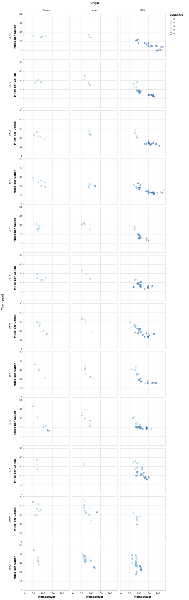


# Julia 可视化库：VegaLite.jl 【笔记3 - vl 宏】

这部分内容需要加载的库 ↓


```julia
using VegaLite
```

## vl 字符串宏 

`vl` 字符串宏提供了直接在 `Julia` 代码中嵌入运行 `VegaLite Json` 格式代码的功能。

### 例子

`vl` 字符串宏提供了直接在 `Julia` 代码中嵌入运行 `VegaLite Json` 格式代码的功能。


```julia
spec = vl"""{
  "data": {
    "values": [
      {"a": "A","b": 28}, {"a": "B","b": 55}, {"a": "C","b": 43},
      {"a": "D","b": 91}, {"a": "E","b": 81}, {"a": "F","b": 53},
      {"a": "G","b": 19}, {"a": "H","b": 87}, {"a": "I","b": 52}
    ]
  },
  "mark": "bar",
  "encoding": {
    "x": {"field": "a", "type": "ordinal"},
    "y": {"field": "b", "type": "quantitative"}
  }
}""";
spec
```


##  @vlplot *VS* Vega-Lite JSON 格式

使用 `vl` 只需要把 `JSON` 字符串代码贴进来，而 `@vlplot` 需要 “手工翻译” `Json` 格式代码。


### 例子

一段简单的 Vega-Lite JSON 可视化代码 ↓

```Json
{
  "data": {
    "values": [
      {"a": "A","b": 28}, {"a": "B","b": 55}, {"a": "C","b": 43},
      {"a": "D","b": 91}, {"a": "E","b": 81}, {"a": "F","b": 53},
      {"a": "G","b": 19}, {"a": "H","b": 87}, {"a": "I","b": 52}
    ]
  },
  "mark": "bar",
  "encoding": {
    "x": {"field": "a", "type": "ordinal"},
    "y": {"field": "b", "type": "quantitative"}
  }
}
```

在 https://vega.github.io/editor/#/custom/vega-lite 中运行结果如下 ↓


用 `@vlplot` 将上面的 Json 代码翻译过来，如下


```julia
@vlplot(
    data={
        values=[
            {a="A",b=28},{a="B",b=55},{a="C",b=43},
            {a="D",b=91},{a="E",b=81},{a="F",b=53},
            {a="G",b=19},{a="H",b=87},{a="I",b=52}
        ]
    },
    mark="bar",
    encoding={
        x={field="a", typ="ordinal"},
        y={field="b", typ="quantitative"}
    }
)
```


### 说明

可以看到 `@vlplot` 宏命令对 ` VegaLite Json` 格式做了些调整：

- 去掉了最外层的 `{}` ，首尾用以宏调用的 `()` 代替。


- Json 格式中键两边的 `"` (双引号) 去掉了。


- Json 格式中键与值的分隔符 `:` 用 `=` 代替。


- Json 格式中名称为 `type` 的键在 `@vlplot` 宏中被命名为 `typ` (因为`type` 是 `Julia` 预留的关键字，此处不可用)。


- 在调用 `@vlplot` 时， Json 格式中的任何 `null` 值应该替换成 `nothing` 

    ( `nothing` 是一个值，比如需要 x轴 无 title，应该这样写：**x={:var, title=nothing}**；需要 x轴 无 刻度，应该这样写：**x={:var, axis=nothing}** )。


```julia
# 将 Json 中的数据代码部分解析成 Julia DataFrame 数据格式
using DataFrames
import JSON

s = """{
  "data": {
    "values": [
      {"a": "A","b": 28}, {"a": "B","b": 55}, {"a": "C","b": 43},
      {"a": "D","b": 91}, {"a": "E","b": 81}, {"a": "F","b": 53},
      {"a": "G","b": 19}, {"a": "H","b": 87}, {"a": "I","b": 52}
    ]
  }
}""";

ss = JSON.parse(s)["data"]["values"];
# data = DataFrame(a = [item["a"] for item in ss], b = [item["b"] for item in ss])
temp = [[item["a"], item["b"]] for item in ss];
data = DataFrame(a = getindex.(temp, 1), b = getindex.(temp, 2))
```


<table class="data-frame"><thead><tr><th></th><th>a</th><th>b</th></tr></thead><tbody><tr><th>1</th><td>A</td><td>28</td></tr><tr><th>2</th><td>B</td><td>55</td></tr><tr><th>3</th><td>C</td><td>43</td></tr><tr><th>4</th><td>D</td><td>91</td></tr><tr><th>5</th><td>E</td><td>81</td></tr><tr><th>6</th><td>F</td><td>53</td></tr><tr><th>7</th><td>G</td><td>19</td></tr><tr><th>8</th><td>H</td><td>87</td></tr><tr><th>9</th><td>I</td><td>52</td></tr></tbody></table>


使用 **速写字符串语法（Shorthand string syntax）** ↓


```julia
data |>
@vlplot(
    mark=:bar, # Note how we use :point instead of "point" here
    encoding={
        x={
            field=:a, # Note how we use :a instead of "a" here
            typ=:ordinal # Note how we use :ordinal instead of "ordinal" here
        },
        y={
            field=:b, # Note how we use :b instead of "b" here
            typ=:quantitative # Note how we use :quantitative instead of "quantitative" here
        }
    }
)
```


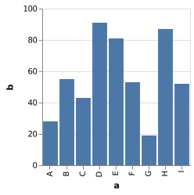


呃，看着好像也没比 `Json` 格式简洁多少...

但是，我们有更简洁的写法 ↓


```julia
data |>
@vlplot(
    :bar,
    x=:a, # string 类型默认 type 为 ordinal
    y=:b # 数值类型默认 type 为 quantitive
)
```


### IO: VegaLite Json 格式文件

`savespec` 和 `loadspec` 提供将 `VegaLite Json` 格式的文件保存或者读取。(在未来的版本中，将被 `save` 和 `load` 替代)

将上面的 `vl` 部分的例子保存成 JSON 格式 ↓


```julia
savespec("myfigure.vegalite", spec)

# "myfigure.vegalite" 文件中的内容为：
# {"encoding":{"x":{"field":"a","type":"ordinal"},"y":{"field":"b","type":"quantitative"}},"mark":"bar"}
# 注意 "data" 键的数据被去掉了
```


```julia
spec = loadspec("myfigure.vegalite");
```


```julia
spec.params
```


    Dict{String,Any} with 2 entries:
      "encoding" => Dict{String,Any}(Pair{String,Any}("x", Dict{String,Any}(Pair{St…
      "mark"     => "bar"


# Julia 可视化库：VegaLite.jl 【笔记4 - 数据来源】

## 内部数据来源

### Julia 表格数据结构

`VegaLite.jl` 涵盖了 julia 生态系统中的大多数表格数据结构: `DataFrames.jl`，`JuliaDB.jl`，`IndexedTables.jl`，各种文件IO库（`CSVFiles.jl`，`FeatherFiles.jl`，`ExcelFiles.jl`，`StatFiles.jl`，`ParquetFiles.jl`）以及 `Query.jl` 中的表格形式。

### 管道操作数据


```julia
using VegaLite, VegaDatasets, Query
```


```julia
cars = dataset("cars");
```


```julia
cars |>
@vlplot(
    :point,
    x=:Horsepower,
    y=:Miles_per_Gallon
)
```


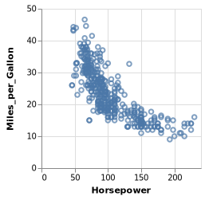


上面的写法等价于 **@vlplot(:point, data=cars, x="Horsepower:q", y="Miles_per_Gallon:q")**


```julia
cars |> # 绘制日本地区的情况
    @filter(_.Origin=="Japan") |>
    @vlplot(
    :point,
    x={:Horsepower, scale={zero=false}},
    y=:Miles_per_Gallon)
```


```julia
# 上面的写法等价于
cars |>
    @vlplot(
    :point,
    transform=[{filter="datum.Origin == 'Japan'"}],
    x={:Horsepower, scale={zero=false}},
    y=:Miles_per_Gallon)
```


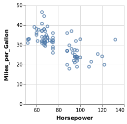


## 外部数据来源

主要是从 **本地文件路径** 和 **网络** 获得数据。这一部分功能目前还不完善。

参见：http://fredo-dedup.github.io/VegaLite.jl/stable/userguide/data.html#Referencing-external-data-1


```julia
using FilePaths
```


```julia
# path = p"folder/filename.csv";
# path |> @vlplot(:point, x=:a, y=:b)
```

上面的命令运行报错，估计功能还没实现。推荐将数据读取进来，然后进行管道操作 ↓


```julia
using CSV
```


```julia
data = CSV.read("data/data.csv") # 笔记 3 中的数据
```


<table class="data-frame"><thead><tr><th></th><th>a</th><th>b</th></tr></thead><tbody><tr><th>1</th><td>A</td><td>28</td></tr><tr><th>2</th><td>B</td><td>55</td></tr><tr><th>3</th><td>C</td><td>43</td></tr><tr><th>4</th><td>D</td><td>91</td></tr><tr><th>5</th><td>E</td><td>81</td></tr><tr><th>6</th><td>F</td><td>53</td></tr><tr><th>7</th><td>G</td><td>19</td></tr><tr><th>8</th><td>H</td><td>87</td></tr><tr><th>9</th><td>I</td><td>52</td></tr></tbody></table>


```julia
data |> @vlplot(:text, x={:a, scale={zers=false}}, y={:b, title=nothing}, text=:a, color=:a)
```


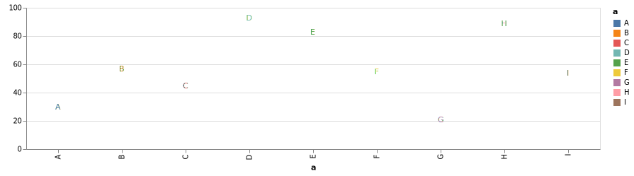


```julia
data |> @vlplot(:text, x="b:o", y={:b, title=nothing, scale={zero=false}}, text=:a, color=:a)
```


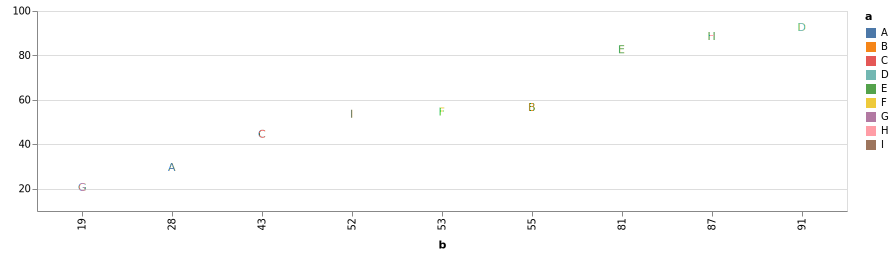


# Julia 可视化库：VegaLite.jl 【笔记5 - 绘图类型 mark】

## Galary & API


**VegaLite.jl** 文档绘图例子： http://fredo-dedup.github.io/VegaLite.jl/stable/index.html

**VegaLite** 官方 Example Galary： https://vega.github.io/vega-lite/examples/

**VegaLite** API 文档( **JSON** 格式)： https://vega.github.io/vega-lite/docs/


## `mark` 特性

```Json
// Json 版本
{
  ...
  "mark": {
    "type": ...,       // mark
    ...
  },
  ...
}
```

```Julia
# Julia 版本
@vlplot(
    mark={
        typ=:..., # 注意不能使用 Julia 预留关键字 type
        ...
    }
)
```

狭义的 `mark` 指的是 `mark` 键下的 `type` 字段

| 类型                   | mark -> type      | x                | y           | color    | shape     | size |
|------------------------|-----------|------------------|-------------|----------|-----------|------|
| 线图                   | :line     |                  |             |          |           |      |
| 轨迹图                 | :trace    |                  |             |          |           |      |
| 垂线、水平线图         | :rule     |                  |             |          |           |      |
| 空心散点图             | :point    |                  |             |          |           |      |
| 圆形实心散点图             | :circle   |                  |             |          |           |      |
| 方形实心散点图             | :square   |                  |             |          |           |      |
| 文字标注图         | :text     |                  |             |          | text=:var |      |
| 柱状图                 | :bar      |                  |             |          |           |      |
| 直方图                 | :bar      | x={:a, bin=true} | y="count()" |          |           |      |
| 热力图、填充图                 | :rect     | x="x:o"          | y="y:o"     | color=:z |           |      |
| area plot (面积堆积图) | :area     |                  |             |          |           |      |
| strip plot(分布散点图) | :tick     | x=:x             | y="y:o"     |          |           |      |
| 地理图                 | :geoshape |                  |             |          |           |      |

广义的 `mark` 包括：`type`、 `style`、 `clip` 三部分。

详细 `mark` 特性参看： https://vega.github.io/vega-lite/docs/mark.html

## 几个栗子

运行例子代码前需要加载以下库 ↓


```julia
using VegaLite, VegaDatasets
```

### Example1


```julia
dataset("stocks") |>
@vlplot(
    :trail, # 等价于 mark = :trail 等价于 mark={typ=:trail}
    x={
        "date:t",
        axis={format="%Y"}
    },
    y=:price,
    size=:price,
    color=:symbol
)
```


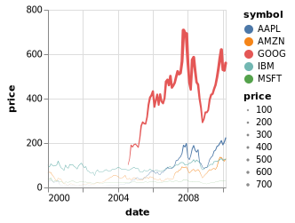


### Example2


```julia
dataset("unemployment-across-industries") |>
@vlplot(
    :area, # 等价于 mark = :area 等价于 mark={typ=:area}
    width=300, height=200,
    x={
        "yearmonth(date)",
        axis={
            domain=false,
            format="%Y",
            tickSize=0
        }
    },
    y={
        "sum(count)",
        axis=nothing,
        stack=:center
    },
    color={
        :series,
        scale={scheme="category20b"}
    }
)
```


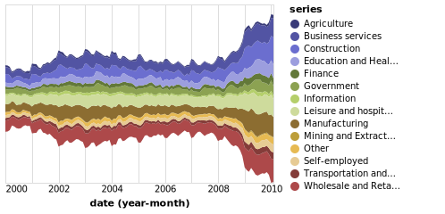


### Example3


```julia
cars |>
    @vlplot(
        y="Origin:o",
        x="Cylinders:o",
        config={
            scale={bandPaddingInner=0, bandPaddingOuter=0},
            text={baseline=:middle}
        }
    ) +
    @vlplot(
        :rect, # 等价于 mark = :rect 等价于 mark={typ=:rect}
        color="count()") +
    @vlplot(
        :text, # 等价于 mark = :text 等价于 mark={typ=:text}
        text="count()",
        color={
            condition={
                test="datum['count_*'] > 100",
                value=:black
            },
            value=:white
        }
)
```


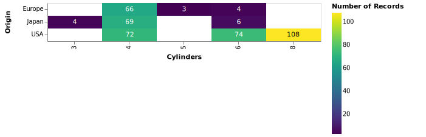


### Example4


```julia
dataset("population") |>
@vlplot(
    transform=[{
        aggregate=[
            {op=:q1, field=:people, as=:lowerBox},
            {op=:q3, field=:people, as=:upperBox},
            {op=:median, field=:people, as=:midBox},
            {op=:min, field=:people, as=:lowerWhisker},
            {op=:max, field=:people, as=:upperWhisker}
        ],
        groupby=[:age]
    }]
) +
@vlplot(
    mark={:rule, style=:boxWhisker},
    y={"lowerWhisker:q", axis={title="population"}},
    y2="lowerBox:q",
    x="age:o"
) +
@vlplot(
    mark={:rule, style=:boxWhisker},
    y="upperBox:q",
    y2="upperWhisker:q",
    x="age:o"
) +
@vlplot(
    mark={:bar, style=:box},
    y="lowerBox:q",
    y2="upperBox:q",
    x="age:o",
    size={value=5}
) +
@vlplot(
    mark={:tick, style=:boxMid},
    y="midBox:q",
    x="age:o",
    color={value=:white},
    size={value=5}
)
```


### Example5


```julia
us10m = dataset("us-10m").path
unemployment = dataset("unemployment.tsv").path

p = @vlplot(
    :geoshape, # mark
    width=500, height=300,
    data={
        url=us10m,
        format={
            typ=:topojson,
            feature=:counties
        }
    },
    transform=[{
        lookup=:id,
        from={
            data=unemployment,
            key=:id,
            fields=["rate"]
        }
    }],
    projection={
        typ=:albersUsa
    },
    color="rate:q"
) 

```


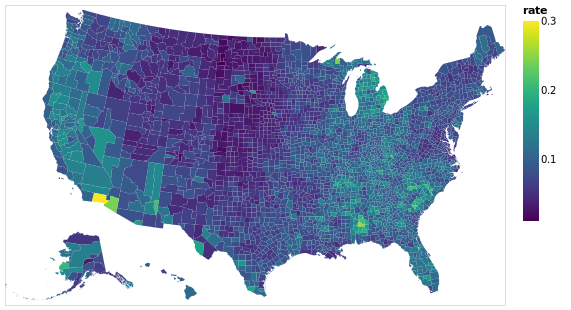


# Julia 可视化库：VegaLite.jl 【笔记6 - transform 之 aggregate】

## `aggregate` 特性

```Json
// Json 版本
{
  ...
  "transform": [
    {
      // Aggregate Transform
      "aggregate": [
          {"op": ..., "field": ..., "as": ...},
          {"op": ..., "field": ..., "as": ...}, 
          ...],
      "groupby": [...]
    }
     ...
  ],
  ...
}
```

```Julia
# Julia 版本
@vlplot(
    ...
    transform=[{
        aggregate=[
            {op=..., field=..., as=...}, 
            {op=..., field=..., as=...}, 
            ...],
        groupby=[...]
        },
        ...
    ],
    ...
)
```

1. `aggregate` 字段下有 `op`、 `field`、 `as` 三个必需的属性。

    - `field` 指的是操作的变量对象。

    - `as` 给操作后的变量一个名称，该名称于所在的代码环境内起作用。

    - `op` 支持以下操作函数。在 `Json` 格式中函数名称使用双引号，即使用 `"op": "operation"`，在 `Julia` 中语法为 `op=:operation`。


2. `aggregate` 可与 `groupby` 字段连用，实现对不同的组进行操作。

| operation | 解释               | operation | 解释                                    |
|-----------|--------------------|-----------|-----------------------------------------|
| count     | 计数               | stderr    | 标准误                                  |
| valid     | 对非空等数值计数   | median    | 中位数                                  |
| missing   | 空值或未定义字段值 | q1        | 下四分位数                              |
| distinct  | 对不同字段的值计数 | q3        | 上四分位数                              |
| sum       | 求和               | ci0       | 根据bootstrapped方法得到的95%下置信区间 |
| mean      | 均值               | ci1       | 根据bootstrapped方法得到的95%上置信区间 |
| average   | 均值               | min       | 最小值                                  |
| variance  | 样本方差           | max       | 最大值                                  |
| variancep | 总体方差           | argmin    | 达到最小值的数据对象                    |
| stdev     | 样本标准差         | argmax    | 达到最大值的数据对象                    |
| stdevp    | 总体标准差         |           |                                         |


## 栗子

一个简单的例子：画出 poplulation 数据集中 150 年各年龄段的平均人口数量。


```julia
using VegaLite, VegaDatasets, DataFrames
popu = DataFrame(dataset("population"))
describe(popu[:,1]) # 1850-2000 年 -> 151 年
```


```julia
dataset("population") |>
@vlplot(
    transform=[
        {
            aggregate=[
            {op=:mean, field=:people, as=:mean_people} # 每个年龄段的人口均值
        ],
            groupby=[:age] # 以年龄段分组
        }
    ],
    :rule,
    x="age:o",
    y="mean_people:q",
)
```

    Summary Stats:
    Mean:           1927.333333
    Minimum:        1850.000000
    1st Quartile:   1880.000000
    Median:         1930.000000
    3rd Quartile:   1970.000000
    Maximum:        2000.000000
    Length:         570
    Type:           Int64


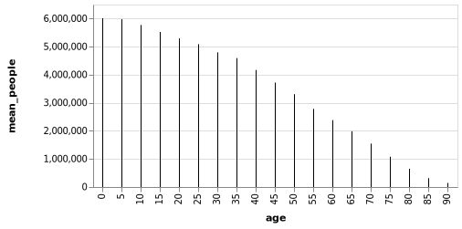


## 应用

一个带有最大值、最小值触须的箱线图 ↓


```julia
using VegaLite, VegaDatasets
```


```julia
dataset("population") |>
@vlplot(
    transform=[{
        aggregate=[
            {op=:q1, field=:people, as=:lowerBox},
            {op=:q3, field=:people, as=:upperBox},
            {op=:median, field=:people, as=:midBox},
            {op=:min, field=:people, as=:lowerWhisker},
            {op=:max, field=:people, as=:upperWhisker}
        ],
        groupby=[:age]
    }]
) +
@vlplot(
    mark={:rule, style=:boxWhisker},
    y={"lowerWhisker:q", axis={title="population"}},
    y2="lowerBox:q",
    x="age:o"
) +
@vlplot(
    mark={:rule, style=:boxWhisker},
    y="upperBox:q",
    y2="upperWhisker:q",
    x="age:o"
) +
@vlplot(
    mark={:bar, style=:box},
    y="lowerBox:q",
    y2="upperBox:q",
    x="age:o",
    size={value=5}
) +
@vlplot(
    mark={:tick, style=:boxMid},
    y="midBox:q",
    x="age:o",
    color={value=:white},
    size={value=5}
)
```


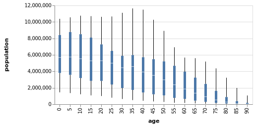


# Julia 可视化库：VegaLite.jl 【笔记7 - transform 之 calculate】

## `calculate` 特性

```Json
// Json 版本
{
  ...
  "transform": [
      // Calculate Transform
      {"calculate": ..., "as" ...}, 
      {"calculate": ..., "as" ...}, 
      {"filter": ...},
       ...
  ],
  ...
}
```

```Julia
# Julia 版本
@vlplot(
    ...
    transform=[
        {calculate= ..., as= ...},
        {calculate= ..., as= ...},
        {filter= ...},
        ...
    ],
    ...
)
```

1. `calculate` 的值为 `expression` 表达式，`datum` 表示当前输入的数据对象，`datum.a` 表示对输入数据列名为 **a** 的数据进行计算。


2. `expression` 中默认的常量有： *NaN*、 *E* （常数 $e$ ）、*LN2* （$log_e 2$）、*LN10* （$log_e 10$）、*LOG2E* （$log_2 e$）、*LOG10E* （$log_{10}  e$）、*MAX_VALUE* （可表示的最大正数）、*MIN_VALUE* （可表示的最小正数）、*PI* （$\pi$）、*SQRT1_2*（$\sqrt {1/2}$）、*SQRT2* （$\sqrt 2$）等。


3. `calculate` 可与 `filter` 连用，对满足某些条件的数据进行计算操作。

 

## 栗子

使用 **LOG10E** 常量，以历史上各年龄段人口数量顶峰值与这个常量的乘积作为y轴，作出垂直线图。并将各年龄段的历史人口数情况以散点形式添加到图上。


```julia
using VegaLite, VegaDatasets
```


```julia
dataset("population") |>
@vlplot() + # 这里相当于定义一层 layer，"+" 表示添加图层
@vlplot(
    transform=[
        {
            calculate="LOG10E * datum.people", 
            # 相当于 log(10, e) * max(people), log(10, e) ≈ 0.434
            as=:people2
        }
    ],
    :rule,
    x="age:o",
    y="people2:q",
)+
@vlplot(
    :point,
    x="age:o",
    y="people:q"
)
```


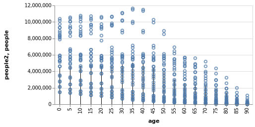


## 应用

带有 1.5 倍四分位距的箱线图 ↓


```julia
using VegaLite, VegaDatasets
```


```julia
dataset("population") |>
@vlplot(
    transform=[
        {
            aggregate=[
                {op=:q1, field=:people, as=:lowerBox},
                {op=:q3, field=:people, as=:upperBox},
                {op=:median, field=:people, as=:midBox}
            ],
            groupby=[:age]
        },
        {
            calculate="datum.upperBox - datum.lowerBox",
            as=:IQR
        },
        {
            calculate="datum.lowerBox - datum.IQR * 1.5",
            as=:lowerWhisker
        },
        {
            calculate="datum.upperBox + datum.IQR * 1.5",
            as=:upperWhisker
        }
    ]
) +
@vlplot(
    mark={:rule, style=:boxWhisker},
    y={"lowerWhisker:q", axis={title="population"}},
    y2="lowerBox:q",
    x="age:o"
) +
@vlplot(
    mark={:rule, style=:boxWhisker},
    y="upperBox:q",
    y2="upperWhisker:q",
    x="age:o"
) +
@vlplot(
    mark={:bar, style=:box},
    y="lowerBox:q",
    y2="upperBox:q",
    x="age:o",
    size={value=5}
) +
@vlplot(
    mark={:tick, style=:boxMid},
    y="midBox:q",
    x="age:o",
    color={value=:white},
    size={value=5}
)
```


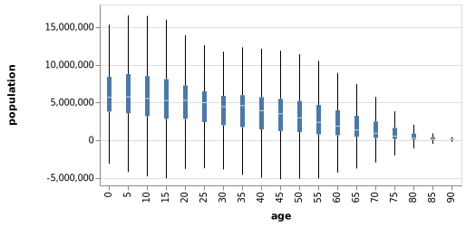


# Julia 可视化库：VegaLite.jl 【笔记8 - transform 之 filter】

## `filter` 特性

```Json
// Json 版本
{
  ...
  "transform": [
      // Filter Transform
      {"filter": ...} 
     ...
  ],
  ...
}
```

```Julia
# Julia 版本
@vlplot(
    ...
    transform=[
        {filter= ...},
        ...
    ],
    ...
)
```

`filter` 的值为逻辑值有以下四种情况：

1. 表达式字符串，以 `datum` 标示当前输入数据对象。如 `filter="datum.a > 60"` 表示筛选出数据中字段为 **a** ，其值大于 60 的整个数据对象。


2. 包含以下字段谓语： **equal** (等于), **lt** (小于), **lte** (小于等于), **gt** (大于), **gte** (大于等于), **range** (表示数值或者时间范围), **oneOf** (表示属于某个集合)。

    如 **filter={field=:car_color, equal="red"}}** 表示筛选 *car_color* 为 *red* 的数据对象； **filter={field=:car_color, oneOf=["red", "yellow"]}}** 表示筛选 *car_color* 为 *red* 或者 *yellow* 的数据对象。


3. selection predicate。参见： https://vega.github.io/vega-lite/docs/filter.html#selection-predicate


4. 前三种情况的组合。


## 栗子

画出 cars 数据集中，1980年至1982年美国地区的汽车情况。


```julia
using VegaLite, VegaDatasets
```


```julia
dataset("cars") |>
@vlplot(
    transform=[
        {filter="datum.Origin=='USA'"},  # 注意字符串内层使用的单引号
        {filter={field=:Year, oneOf=["1980-01-01", "1981-01-01", "1982-01-01"]}},
    ],
    :point,
    x={:Acceleration, scale={zero=false}}, # 坐标范围不从 0 开始
    y={:Horsepower, scale={zero=false}},
    color="Cylinders:n",
    title="USA"
)
```


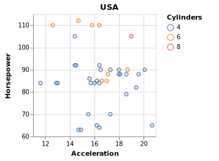


## 应用

描绘20世纪世界人口各年龄段性别比例构成情况。


```julia
using VegaLite, VegaDatasets
```


```julia
dataset("population") |>
@vlplot(
    :bar,
    transform=[
        {filter={field=:year, range=[1900, 2000]}},
        {calculate="datum.sex==2 ? 'Female' : 'Male'",as="gender"}
    ],
    enc={
        y={
            "sum(people)",
            axis={title="population"},
            stack=:normalize # 归一化
        },
        x={
            "age:o",
            scale={rangeStep=30} # 调整柱子的宽度
        },
        color={
            "gender:n",
            scale={range=["#c30d24", "#1770ab"]}
        }
    }
)
```


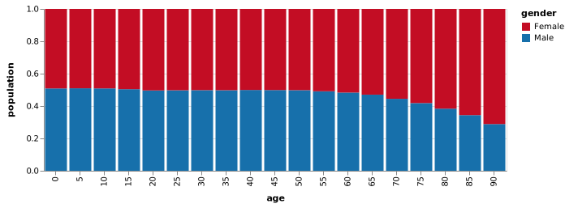


